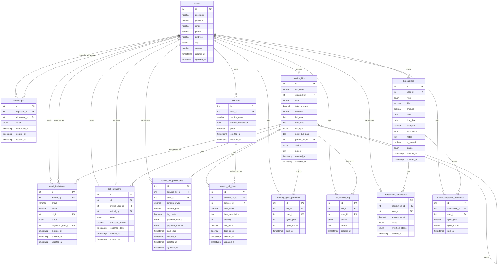

```mermaid
erDiagram
    users {
        int id PK
        varchar username
        varchar password
        varchar email
        varchar phone
        varchar address
        varchar city
        varchar country
        timestamp created_at
        timestamp updated_at
    }

    friendships {
        int id PK
        int requester_id FK
        int addressee_id FK
        enum status
        timestamp responded_at
        timestamp created_at
        timestamp updated_at
    }

    services {
        int id PK
        int user_id FK
        varchar service_name
        text service_description
        decimal price
        timestamp created_at
        timestamp updated_at
    }

    service_bills {
        int id PK
        varchar bill_code
        int created_by FK
        varchar title
        decimal total_amount
        varchar currency
        date bill_date
        date due_date
        enum bill_type
        date next_due_date
        int parent_bill_id FK
        enum status
        text notes
        timestamp created_at
        timestamp updated_at
    }

    email_invitations {
        int id PK
        int invited_by FK
        varchar email
        varchar token
        int bill_id FK
        enum status
        int registered_user_id FK
        timestamp expires_at
        timestamp created_at
        timestamp updated_at
    }

    bill_invitations {
        int id PK
        int bill_id FK
        int invited_user_id FK
        int invited_by FK
        enum status
        decimal proposed_amount
        timestamp response_date
        timestamp created_at
        timestamp updated_at
    }

    service_bill_participants {
        int id PK
        int service_bill_id FK
        int user_id FK
        decimal amount_owed
        decimal amount_paid
        boolean is_creator
        enum payment_status
        enum payment_method
        timestamp paid_date
        timestamp hidden_at
        timestamp created_at
        timestamp updated_at
    }

    service_bill_items {
        int id PK
        int service_bill_id FK
        int service_id FK
        varchar item_name
        text item_description
        int quantity
        decimal unit_price
        decimal total_price
        timestamp created_at
        timestamp updated_at
    }

    monthly_cycle_payments {
        int id PK
        int bill_id FK
        int user_id FK
        int cycle_year
        int cycle_month
        timestamp paid_at
    }

    bill_activity_log {
        int id PK
        int bill_id FK
        int user_id FK
        enum action
        text details
        timestamp created_at
    }

    transactions {
        int id PK
        int user_id FK
        enum type
        varchar title
        decimal amount
        date date
        date due_date
        varchar category
        enum recurrence
        text notes
        boolean is_shared
        enum status
        timestamp created_at
        timestamp updated_at
    }

    transaction_participants {
        int id PK
        int transaction_id FK
        int user_id FK
        decimal amount_owed
        enum status
        enum invitation_status
        timestamp created_at
    }

    transaction_cycle_payments {
        int id PK
        int transaction_id FK
        int user_id FK
        smallint cycle_year
        tinyint cycle_month
        timestamp paid_at
    }

    %% User relationships
    users ||--o{ friendships : "requester"
    users ||--o{ friendships : "addressee"
    users ||--o{ services : "owns"
    users ||--o{ service_bills : "creates"
    users ||--o{ email_invitations : "sends"
    users ||--o{ email_invitations : "registers as"
    users ||--o{ bill_invitations : "invites"
    users ||--o{ bill_invitations : "receives"
    users ||--o{ service_bill_participants : "participates"
    users ||--o{ monthly_cycle_payments : "pays"
    users ||--o{ bill_activity_log : "logs"
    users ||--o{ transactions : "owns"
    users ||--o{ transaction_participants : "participates"
    users ||--o{ transaction_cycle_payments : "pays"

    %% Service bill relationships
    service_bills ||--o{ service_bills : "parent"
    service_bills ||--o{ email_invitations : "referenced by"
    service_bills ||--o{ bill_invitations : "has"
    service_bills ||--o{ service_bill_participants : "has"
    service_bills ||--o{ service_bill_items : "has"
    service_bills ||--o{ monthly_cycle_payments : "tracks"
    service_bills ||--o{ bill_activity_log : "logged in"

    %% Service bill items
    services ||--o{ service_bill_items : "referenced by"

    %% Transaction relationships
    transactions ||--o{ transaction_participants : "has"
    transactions ||--o{ transaction_cycle_payments : "tracks"
```
